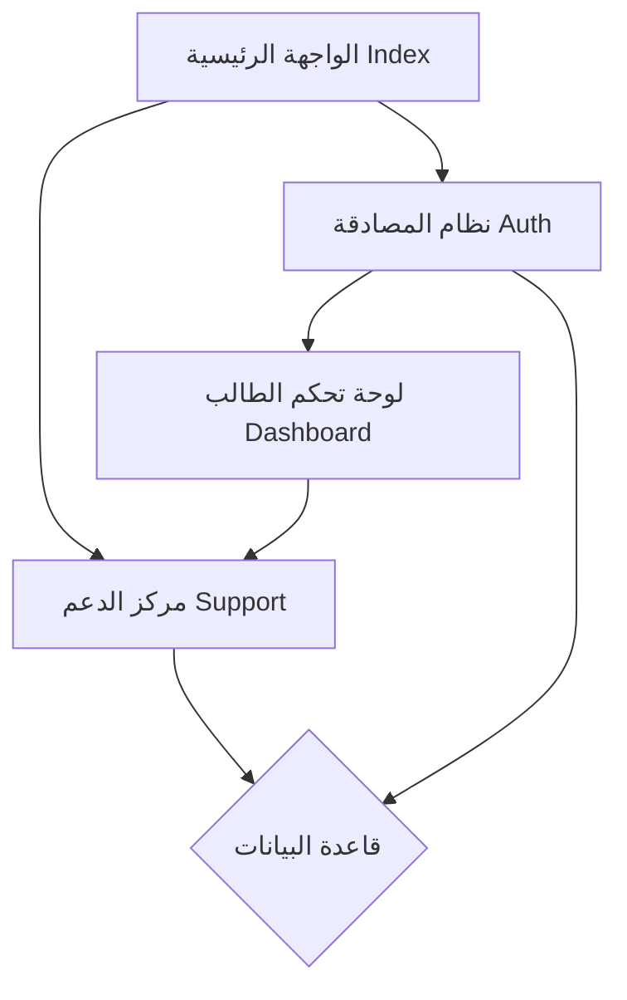

# 🌟 أهل القرآن | Ahl Alquran 🌟
### النظام المتكامل لإدارة مسابقات القرآن الكريم الدولية


---

## 📖 نظرة عامة
**أهل القرآن** هو منصة رقمية متطورة مصممة لإدارة المسابقات القرآنية بأسلوب عصري يجمع بين الأصالة والتقنية. يهدف المشروع إلى تسهيل عملية التسجيل، التحكيم، وإعلان النتائج بأعلى معايير الدقة والجمالية.

---

## 🚀 آخر التحديثات (الإنجازات)

### 💎 مركز الدعم الفني الذكي (Support Center)
تم إطلاق نظام الدعم الفني الجديد بتصميم **Premium** يعتمد على تجربة المستخدم (UX) الحديثة:
- **واجهة عصرية:** استخدام تقنيات Glassmorphism وAnimations سلسة.
- **تعدد قنوات التواصل:** تكامل مباشر مع WhatsApp, Email, وتذاكر الدعم الداخلية.
- **قسم الأسئلة الشائعة (Interactive FAQ):** نظام أكورديون تفاعلي لتسهيل الوصول للمعلومات.
- **تكامل شامل (Link Unification):** تم ربط كافة صفحات النظام (Login, Register, Dashboard, Index) بمركز الدعم لضمان عدم ضياع المستخدم.

### 🛠️ التحسينات التقنية
- **Dynamic Routing:** تحويل كافة الروابط الثابتة إلى روابط ديناميكية باستخدام Django URL tags لضمان استقرار النظام.
- **Clean Code:** إصلاح كافة أخطاء الـ Syntax في الـ Templates وتوحيد معايير التصميم عبر استخدام نظام Tailwind CSS بشكل احترافي.
- **Performance Optimization:** تحسين سرعة تحميل الصفحات عبر ضغط الموارد واستخدام مكتبات Google Fonts وCDN بشكل محسّن.

---

## 🗺️ خارطة الطريق (Roadmap)

### 🟢 المرحلة الحالية (قيد التنفيذ)
- [x] ربط كافة واجهات التواصل بمركز الدعم.
- [x] إصلاح أخطاء الـ Logic في لوحة التحكم.
- [x] تحسين توافقية الموقع مع الهواتف الذكية (Mobile First).

### 🟡 المرحلة القادمة (Short Term)
- [ ] تفعيل نظام إرسال الرسائل الحقيقي من نموذج الدعم.
- [ ] بناء لوحة تحكم الإدارة (SuperAdmin Dashboard) لإدارة المتسابقين.
- [ ] إطلاق صفحة "عن المقرأة" و "النتائج التفصيلية".

### 🔴 التوسع (Long Term)
- [ ] إضافة نظام الاختبارات الصوتية المباشرة عبر المنصة.
- [ ] إصدار تطبيق الهاتف (iOS/Android) المرتبط بنفس قاعدة البيانات.

---

## 📜 سجل النشاطات الأخير (Recent Activity)
*مستخرج من سجلات النظام (Commit History):*

- **`fbaac8a`** - تفعيل نظام المصادقة المتكامل (Login/Register) مع قوالب لوحة التحكم.
- **`c10bfe0`** - بناء واجهة لوحة تحكم الطالب باستخدام Tailwind وتفعيل نظام المسارات (Routing).
- **`4167d3a`** - دمج الأصول الثابتة (Static Assets) وتطوير الـ UI الخاص بلوحة التحكم.
- **`9c2d38e`** - تهيئة إعدادات المشروع الأساسية والـ Middleware الخاصة بالمصادقة.
- **`740935f`** - تصميم وبرمجة قوالب التسجيل والدخول بأسلوب عصري.
- **`2a39d51`** - إطلاق صفحات الشروط والأحكام وسياسة الخصوصية.
- **`7669b76`** - بناء قواعد البيانات Schema الخاصة بالمستخدمين والمتسابقين.

### ⚡ تحديثات قيد الربط (Latest Updates - In Progress)
- [x] إطلاق مركز الدعم الفني الذكي (`support.html`).
- [x] ربط كافة صفحات النظام بمركز الدعم (`Login`, `Register`, `Dashboard`).
- [x] تحويل كافة الروابط الثابتة إلى ديناميكية (`Dynamic URLs`).
- [x] تطوير ملف الـ README ليكون دليلاً فنياً شاملاً للمشروع.

---

## 📂 هيكلية المشروع (Project Architecture)



---

## 💻 تعليمات التشغيل والمساهمة

1. **إعداد البيئة:**
   ```bash
   pip install -r requirements.txt
   python manage.py migrate
   python manage.py runserver
   ```
2. **الوصول للمشروع:**
   - الواجهة الرئيسية: `http://127.0.0.1:8000/`
   - الدعم الفني: `http://127.0.0.1:8000/support/`
   - لوحة التحكم: `http://127.0.0.1:8000/dashboard/`

---

## 🤝 المساهمة
إذا كنت ترغب في تحسين هذا المشروع، يرجى تقديم Pull Request أو التواصل مع **الدعم الفني** مباشرة عبر المنصة.

> "خَيْرُكُمْ مَنْ تَعَلَّمَ الْقُرْآنَ وَعَلَّمَهُ"

---
**تم التحديث بواسطة:** Antigravity AI
**تاريخ التحديث:** ١٠ أبريل ٢٠٢٦
